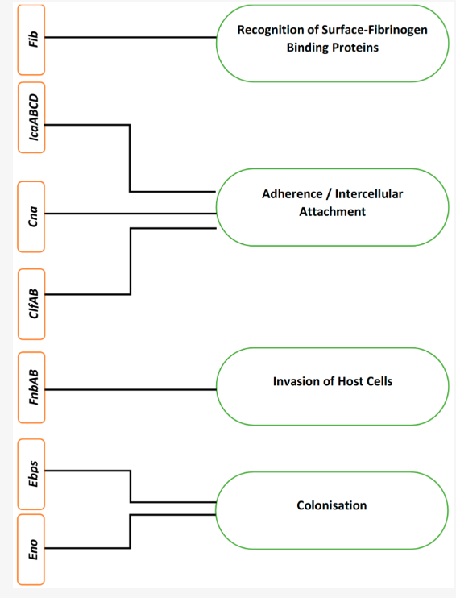

## Biofilm

``-m biofilm``

The biofilm module identifies key *Staphylococcus aureus* genes involved in biofilm formation, including surface proteins (*clfA*, *clfB*, *fnbA*, *fnbB*), the collagen-binding protein *cna*, polysaccharide intercellular adhesin genes (*icaA–D*), and the *icaR* regulator. These genes contribute to adhesion, biofilm maturation, and regulation of the biofilm phenotype ([Idrees et al. 2021](https://pubmed.ncbi.nlm.nih.gov/34300053/)).  

*Figure 1. Biofilm formation (Idrees et al. 2021).*

A curated FASTA file containing representative biofilm gene sequences is bundled with the module and stored in the ``/data`` directory.

All the genes found are annotated as follow:

* No annotation: an exact nucelotide match is found

* ``^``: inexact nucleotide match but perfect amino acidic match

* ``*``: inexact nucleotide and inexact amino acidic match

* ``?``: incomplete match

* ``-X%``: truncated amino acidic sequence

### Parameters

Hits are filtered by minimum alignment identity and coverage:

``--min_id_biofilm`` : Minimum alignment percentage identity (default: 90)

``--min_cov_biofilm``: Minimum alignment percentage coverage (default: 80)

All hits with 80–90% identity or 40–80% coverage are reported as spurious hits.

### Biofilm score

A biofilm score is calculated, based on the genes detected. 

It follows this criteria:

* 5: *cna* + *icaABCD* + *clf* + *fnb*

* 4: *icaABCD* + *clf*/*cna* + *fnb*

* 3: *icaABCD* + *fnb*

* 2: *icaABCD* + *clf*/*cna*

* 1: *icaABCD*

* 0: *icaABCD* incomplete/absent

This scoring system reflects the multifactorial nature of *S. aureus* biofilm formation, wherein the cumulative presence of these specific genes signifies increased biofilm-forming capacity and enhanced virulence ([Nathan K et al. 2011](https://www.tandfonline.com/doi/full/10.4161/viru.2.5.17724#d1e149); [Zapotoczna et al. 2016](https://journals.plos.org/plospathogens/article?id=10.1371/journal.ppat.1005671)). 

The presence of the *icaABCD* operon is crucial for biofilm development (Score 1), particularly in methicillin-sensitive *S. aureus isolates* ([Cramton et al. 2001](https://pmc.ncbi.nlm.nih.gov/articles/PMC98472/); [Zapotoczna et al. 2016](https://journals.plos.org/plospathogens/article?id=10.1371/journal.ppat.1005671)). A complete icaADBC operon, along with its repressor *icaR*, is essential for the synthesis of PIA polysaccharides, which are crucial for intercellular adhesion and biofilm formation ([Piechota et al. 2018](https://doi.org/10.1155/2018/4657396Digital)).

Increasing the biofilm potential (Score 2), the co-occurrence of surface proteins like *cna*, *clfA* or *clfB*, facilitates adhesion to different surfaces ([Foster. 2019](https://pubmed.ncbi.nlm.nih.gov/31267926/); [Madani et al. 2017](https://journals.plos.org/plosone/article?id=10.1371/journal.pone.0179601)). The genes *fnbA* and/or *fnbB* with the icaABCD operon (Score 3), facilitates stronger adhesion to host tissues and medical devices, thereby enhancing the overall biofilm architecture and its resilience against antimicrobial agents ([O'Neill et al. 2008](https://pubmed.ncbi.nlm.nih.gov/18375547/)). 

Finally, the combinations of the previously genes (Score 4 and 5), characterize isolates with both versatility and high-production capacity.  ([Idrees M et al. 2021](https://pubmed.ncbi.nlm.nih.gov/34300053/)). 

### Output

Results are grouped for each gene-family, and reported individually if any imperfect match is found.

| Field                          | Description                                                   |
| ------------------------------ | ------------------------------------------------------------- |
| `biofilm_score`                  | Biofilm score (0–5)                                           |
| `biofilm_truncated_hits`        | Genes with truncations or premature stop codons               |
| `biofilm_spurious_hits`          | Genes with weak hits                                          |
| `cna`                            | Detected cna                                                  |
| `clfAB`                          | Status of clfA and clfB genes (Complete/Incomplete/-)         |
| `fnbAB`                          | Status of fnbA and fnbB genes (Complete/Incomplete/-)         |
| `icaADBC`                        | Status of icaA–D genes (Complete/Incomplete/-)                |
| `clf_genes`                      | Detected clf genes                                            |
| `fnb_genes`                      | Detected fnb genes                                            |
| `ica_genes`                      | Detected ica genes                                            |
| `icaR_mutations` ([Schwartbeck et al. 2024](https://pubmed.ncbi.nlm.nih.gov/38316375/)) | Truncated icaR regulator                              |
