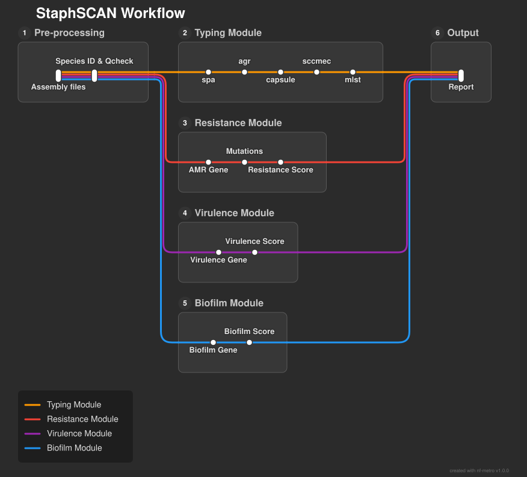

# StaphSCAN: a genome-based tool for **S**urveillance through **C**omprehensive **A**nalysis and sta**N**dardized reporting of ***Staph**ylococcus aureus*.

StaphSCAN is a genome-based framework for the surveillance of Staphylococcus aureus.

It integrates the following steps:

* Species identification
* Qcheck of genome assembly
* MLST typing
* spa typing
* Capsular polysaccharide typing
* SCCmec typing
* Detection of virulence genes (including biofilm)
* Detection of antimicrobial resistance genes (inclduing relevant mutations)

 

For more information, see the [Modules](modules.md) section.

Acknowledgements
----------------
StaphSCAN is inspired by [Kleborate](https://github.com/klebgenomics/Kleborate/tree/main). 

